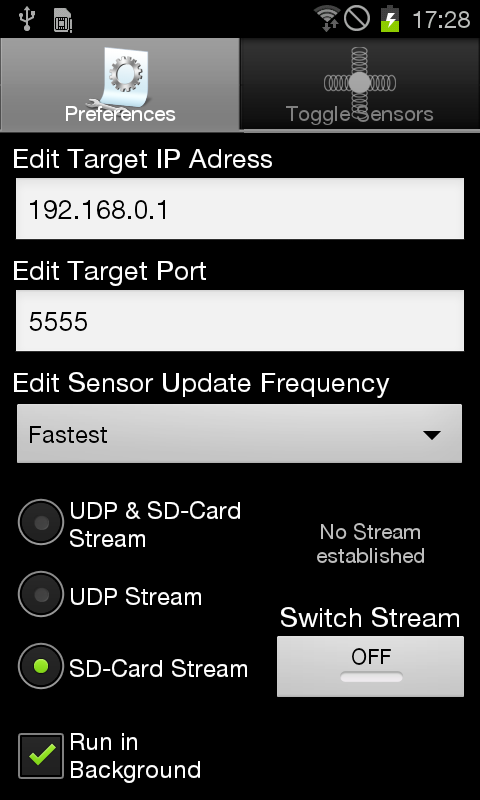
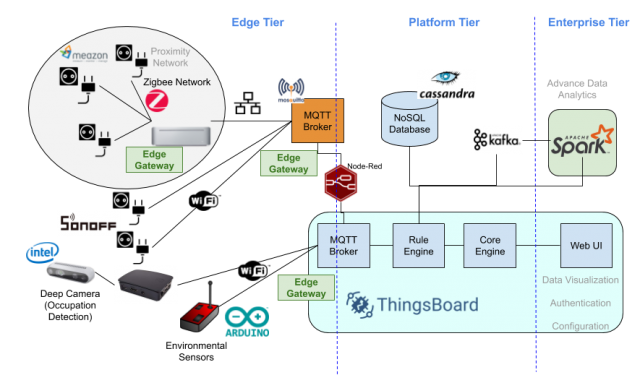

# IoT 2022 - Project

## IoT Device

We are using as our IoT data source an Android Phone with the app **Sensorstream IMU+GPS**
 (https://play.google.com/store/apps/details?id=de.lorenz_fenster.sensorstreamgps) installed.



This application allows the user to collect data from the sensor present in the smartphone and send the data 
collect via UDP to a Gateway.

The Gateway will receive the data and execute the logic, go store the data or execute another business logic.

## Python Gateway

### Python Virtual Environment

We will use a Python Virtual Environment to not messing up with the entire OS files. 

```shell
python3 -m venv venv
```

Use the virtual environment.

```shell
source ./venv/bin/activate
```

Tip: For leaving the virtual environment type 

```shell
deactivate
```

## Install Dependencies

For installing the dependencies

```shell
sudo python3 -m pip install -r requirements.txt
```
#### Paho MQTT

Eclipse Paho MQTT Python is a client library which implements versions 5.0, 3.1.1, and 3.1 of the MQTT protocol.

https://github.com/eclipse/paho.mqtt.python/tree/master/examples

### The Objectives

1. Receive the data produced by an IoT device
2. Store the data in an MQTT Server hosted in the cloud
3. Read the data and take some action

### Reference Architecture Used in This Project



```
ALEXAKOS, Christos et al. Building an industrial IoT infrastructure with open source software for smart energy. In: 2019 First International Conference on Societal Automation (SA). IEEE, 2019. p. 1-8.
```

# Tips

1. When the phone enters in sleep mode the data stream stopping

# Extra Examples Using**Sensorstream IMU+GPS** 

1. https://github.com/chanlhock/IMU/blob/master/imu.py
2. https://github.com/olliematthews/phone_animation/blob/master/run.py